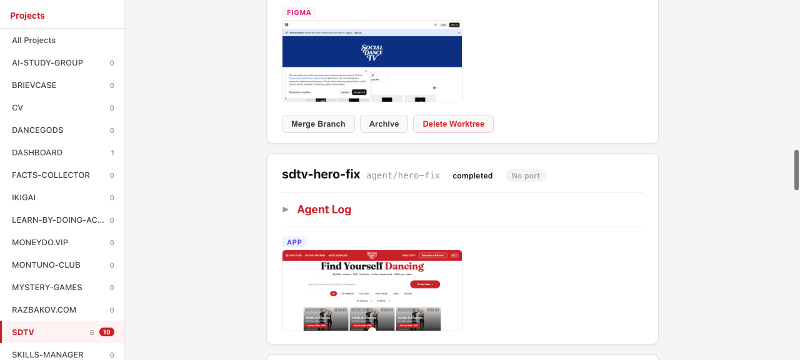

# Tasks Dashboard

A local web UI for monitoring AI coding agents. Works alongside [OpenClaw](https://openclaw.ai) to give you a real-time view of:

- Running and completed agent tasks (from `~/Tasks/`)
- Live tmux output from active agents
- Suggested next tasks with Approve/Reject buttons
- Screenshots of built pages (app screenshot + Figma design side by side)



## Prerequisites

- [OpenClaw](https://openclaw.ai) installed and running
- [Bun](https://bun.sh) runtime
- [tmux](https://github.com/tmux/tmux) terminal multiplexer
- [agent-browser](https://github.com/anthropics/agent-browser) for taking screenshots (`brew install agent-browser && agent-browser install`)
- [faster-whisper](https://github.com/SYSTRAN/faster-whisper) (optional, for audio transcription)

## Setup

```bash
git clone <repo-url>
cd tasks-dashboard
bun install
bun run server.ts
```

The dashboard runs on [http://localhost:4000](http://localhost:4000).

## How It Works with OpenClaw

The dashboard is part of a larger agent orchestration loop powered by OpenClaw:

1. **OpenClaw's Claw agent creates git worktrees** in `~/Tasks/PROJECT-TASK/` — each task gets its own isolated copy of the repo.
2. **Agents run via tmux sessions** named `wf-TASK` — the dashboard detects these sessions and streams their output live.
3. **Agents write artifacts** to `~/Tasks/PROJECT-TASK/`:
   - `task.json` — structured metadata about the task
   - `STATUS.md` — human-readable summary
   - `screenshot.png` — screenshot of the built page
   - `figma-screenshot.png` — screenshot of the Figma design (for comparison)
   - `agent.log` — raw Claude agent transcript (JSON lines)
4. **Dashboard scans `~/Tasks/`** and displays all task directories as cards, grouped by project.
5. **Agents POST suggested follow-up tasks** to `/api/suggestions/:project` — these appear as actionable items in the dashboard.
6. **OpenClaw has a cron job** (every 1 minute) that checks `~/Tasks/suggestions.json` for approved suggestions and spawns new agents.
7. **Approve a suggestion on the dashboard** — the agent spawns immediately (or within 1 minute via the cron fallback).

## task.json Schema

Each agent writes a `task.json` file to its worktree directory. The full schema:

```json
{
  "task": "project-task-name",
  "branch": "agent/task-name",
  "status": "done | running | failed | pending",
  "devPort": 3001,
  "url": "http://localhost:3001",
  "summary": "Brief description of what was done",
  "originalTask": "The original task prompt given to the agent",
  "howToTest": [
    "Open http://localhost:3001",
    "Click the login button",
    "Verify the form appears"
  ],
  "screenshot": "screenshot.png",
  "figmaUrl": "https://www.figma.com/design/...",
  "figmaScreenshot": "figma-screenshot.png",
  "completedAt": "2026-03-19T12:00:00.000Z"
}
```

| Field | Type | Description |
|---|---|---|
| `task` | string | Task directory name (e.g. `myapp-login-page`) |
| `branch` | string | Git branch name |
| `status` | string | One of: `done`, `running`, `failed`, `pending` |
| `devPort` | number | Local dev server port (dashboard pings it for health check) |
| `url` | string | URL to the running dev server |
| `summary` | string | Short summary of what was accomplished |
| `originalTask` | string | The original prompt/task description |
| `howToTest` | string[] | Steps to manually verify the work |
| `screenshot` | string | Filename of the app screenshot |
| `figmaUrl` | string | Figma design URL for reference |
| `figmaScreenshot` | string | Filename of the Figma design screenshot |
| `completedAt` | string | ISO 8601 timestamp of completion |

## Agent Prompt Template

When writing agent prompts, include this standard ending snippet so agents report their results to the dashboard:

```
When done:

1. Write ~/Tasks/PROJECT-TASK/task.json:
{
  "task": "PROJECT-TASK",
  "branch": "agent/TASK",
  "status": "done",
  "summary": "<what you did>",
  "originalTask": "<the original prompt>",
  "howToTest": ["<step 1>", "<step 2>"],
  "completedAt": "<ISO timestamp>"
}

2. Take a screenshot:
agent-browser screenshot --url http://localhost:PORT --output ~/Tasks/PROJECT-TASK/screenshot.png

3. Suggest follow-up tasks:
curl -X POST http://localhost:4000/api/suggestions/PROJECT \
  -H 'Content-Type: application/json' \
  -d '{"title": "Next task title", "description": "What to do", "priority": "medium"}'

4. Notify OpenClaw:
openclaw system event --text 'Done: TASK description' --mode now
```

## API Endpoints

| Method | Endpoint | Description |
|---|---|---|
| GET | `/api/tasks` | List all tasks from `~/Tasks/` |
| GET | `/api/tmux-sessions` | List active tmux sessions |
| GET | `/api/tmux/:session` | SSE stream of tmux pane output (1s interval) |
| GET | `/api/suggestions` | Get all suggestions grouped by project |
| POST | `/api/suggestions/:project` | Add a suggestion (`{ title, description, priority }`) |
| PATCH | `/api/suggestions/:project/:id` | Update suggestion status (`{ status: "approved" \| "rejected" }`) |
| POST | `/api/spawn-agent` | Spawn a new agent (`{ project, id, title, description }`) |
| GET | `/screenshots/:task` | Serve `screenshot.png` for a task |
| GET | `/figma-screenshots/:task` | Serve `figma-screenshot.png` for a task |

## Development

Run in watch mode (auto-restarts on file changes):

```bash
bun run dev
```

### Adding a New Project

Projects are derived automatically from task directory names. The convention is `PROJECT-TASK` — for example, `myapp-login-page` belongs to the `MYAPP` project. To add tasks for a new project, just create worktrees in `~/Tasks/` following this naming convention.

Suggestions can also create new project groups. POST to `/api/suggestions/myproject` and the project will appear in the sidebar.
